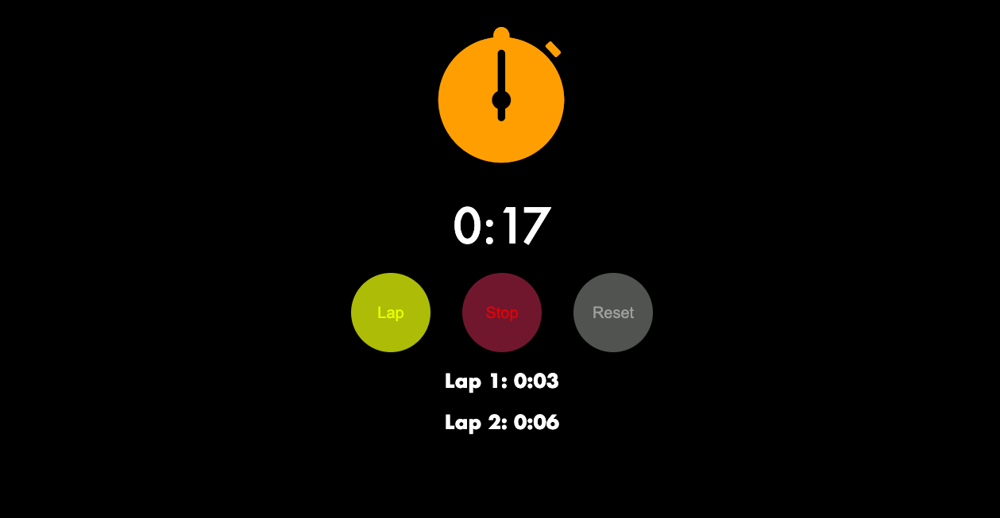

# Stopwatch App

This is a simple React-based Stopwatch application. It allows users to start, stop, reset a timer, and record laps during the timer’s operation. 



## Features
- Start and stop a timer
- Record lap times
- Reset the timer and clear lap records

## Setup Instructions

### Prerequisites
- Node.js installed on your machine
- A package manager like `npm` or `yarn`

### Installation

1. Clone the repository:
   ```bash
   git clone https://github.com/your-username/stopwatch-app.git
   cd stopwatch-app
   ```

2. Install dependencies:
   ```bash
   npm install
   ```

3. Start the development server:
   ```bash
   npm start
   ```

   The app will be available at `http://localhost:3000`.
